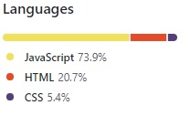
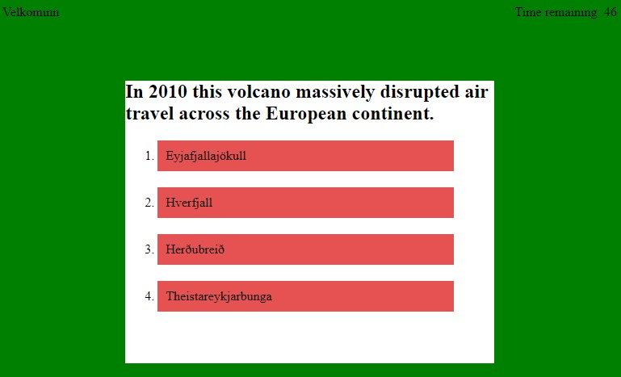
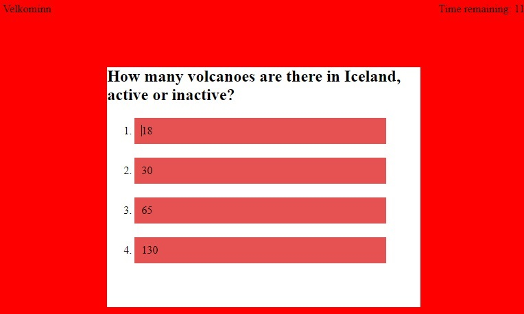
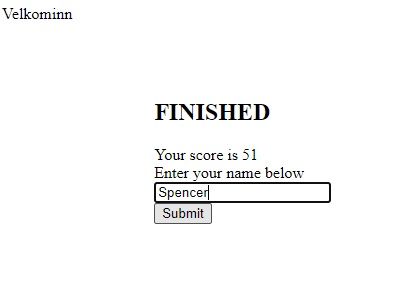
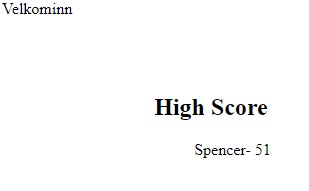

Volcano Quiz CHALLENGE
=====
The purpose of this quiz is not to test one's knowledge of hard to pronounce words but rather demonstate how they can create and modify elements using javascript and DOM manipulation. Very little starting HTML was used for this project, a majority of the code lies in the javascript file.

----

## What's inside??
As you can see the project was made from nearly 74% javascript.



All of the questions and answers for the quiz were stored in the javascript file as an object array.
```
var question = [
  {
    questionText: "Which is Icelands largest volcano?",
    choices: ["Esjufjöll", "Öræfajökull", "Bárðarbunga", "Trölladyngja"],
    answer: "Bárðarbunga",
  },
  {
    questionText: "In 2010 this volcano massively disrupted air travel across the European continent.",
    choices: ["Eyjafjallajökull", "Hverfjall", "Herðubreið", "Theistareykjarbunga"],
    answer: "Eyjafjallajökull",
  },
  ...
  ...
];
```
This makes it very simple to call on the question, answers and correct answer while moving through the quiz.
```
function getAnswers() {
  quizAnswers.innerHTML = "";
  quizHeader.innerHTML = "";
  quizHeader.innerHTML = question[questionIndex].questionText;

  for (i = 0; i < question[questionIndex].choices.length; i++) {
    var answer = question[questionIndex].choices[i];

    var li = document.createElement("li");
    li.textContent = answer;
    li.addEventListener("click", handleChoice);

    quizAnswers.appendChild(li);
  }
}
```
The handleChoice function that is called increments the questionIndex, moving to the next set of questions and answers and includes a condition whether the chosen answer was in the `question[questionIndex].answer` position.
If the user selects the correct answer the background outside the main container turns green.


If they are incorrect the background turns red and additional time is taken off the timer.


Regardless of their choice, issuing a click on an element advances to the next question unltil the end of the quiz.

When the quiz is completed the user enters their name or some identifier and their score, which corresponds with the remaining time is recorded and added to their local storage and displayed for them.




More functionality could be added to include further interactions with the local data such as being able to clear it from this screen.

----

## Built Using
* Javascript
* HTML
* CSS
* Git
* GitHub

----

## Author
Spencer Christy<br>
[GitHub](https://github.com/spenrad)<br>
[LinkedIn](https://www.linkedin.com/in/spencer-christy-543b84b3/)<br>

----

## Acknowledgements
Thank you for reading and I hope you scored high on the quiz. As a note you must be able to pronounce all volcano names or yout score doesn't count!